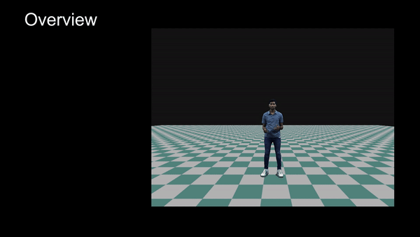
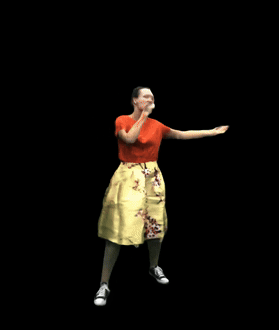

# Codebase for the Holoported Characters #
Tensorflow implementation of [Holoported Characters: Real-time Free-viewpoint Rendering of Humans from Sparse RGB Cameras](https://vcai.mpi-inf.mpg.de/projects/holochar/).

CVPR, 2024

[Ashwath Shetty](https://ashwath98.github.io/)<sup>1,2</sup>,
 [Marc Habermann](https://people.mpi-inf.mpg.de/~mhaberma/)<sup>1,3</sup>,
 [Guoxin Sun](https://people.mpi-inf.mpg.de/~gsun/)<sup>1</sup>,
 [Diogo Luvizon](https://people.mpi-inf.mpg.de/~dluvizon/)<sup>1</sup>,
 [Vladislav Golyanik](https://people.mpi-inf.mpg.de/~golyanik/)<sup>1,3</sup>,
and 
 [Christian Theobalt](https://people.mpi-inf.mpg.de/~theobalt/)<sup>1,3</sup>
 
 
 <sup>1</sup>Max Planck Institute for Informatics,Saarland Informatics Campus , <sup>2</sup>Saarland University<sup>3</sup>Saarbrücken Research Center for Visual Computing, Interaction and AI
 


## Loose Clothing Result ##

## Contents ##

This codebase contains the following VCAI/GVDH publications: 


- Holoported Characters: Real-time Free-viewpoint Rendering of Humans from Sparse RGB Cameras (Shetty et al. 2024 (CVPR 2024)) [`Project Page`](https://vcai.mpi-inf.mpg.de/projects/holochar/) 

Further, it contains also more general tools such as a differentiable renderer, data readers, etc.


## Structure ## 

The code is structured in three main components:

1) The python-based deep learning framework ([Projects](Projects)). This contains the training code, texturing code, and general tools to process the Holported Characters Dataset
2) The custom Tensorflow operators, which are implemented in C++/CUDA ([CustomTensorFlowCPPOperators](CustomTensorFlowCPPOperators))
3) The Cuda-based rasterizer ([CudaRenderer](CudaRenderer))

You would need to install the custom Tensorflow and CUDA Rasterizer before if you would like to run training. It requires GCC 10.2, and we are working on a version to port it to modern setups. 

Please note: This repo is a work in progress, please report any bugs or issues you face via email or issues, I would be happy to help out and improve it so that more people can use it. Please also create issues about features and information you would like


## Installation ## 

### Installation on the Linux servers: ###

**Anaconda / Python / Tensorflow Installation**
- Create a conda environment: `conda create --name tf280 python=3.9`
- Activate your environment: `conda activate tf280`
- Install the cudatoolkit package: `conda install -c nvidia cudatoolkit=11.2.0`
- Install the cudatoolkit-dev package: `conda install -c conda-forge cudatoolkit-dev=11.2.2`
- Install tensorflow package: `pip install tensorflow==2.8.0`
- Tensorflow 2.8.0 does not natively finds the cuda package: To fix this do the following:
  - Open your bashrc_private: `vi ~/.bashrc_private`
  - Add the path to your cuda lib to the LD_LIBRARY_PATH variable. 
  - Example: `export LD_LIBRARY_PATH=$LD_LIBRARY_PATH:/HPS/RTMPC/work/Anaconda/envs/tf280/pkgs/cuda-toolkit/lib64`
  - Close the script and run `source ~/.bashrc_private`
- Now test the tensorflow:
  - Login to the gpu20 server: `srun -p gpu20 --gres gpu:1 --pty /bin/bash`
  - Activate the new environment: `conda activate tf280`
  - Open python: `python`
  - Type: `import tensorflow as tf`
  - Type: `t=tf.constant(8)`
  - If no no-found errors are shown your conda/python/tensorflow is successfully installed
If you are not using slurm, you can just run the code on your machine without logging into server 
**Compiling the custom Tensorflow operators**
- Go to `CustomTensorFlowCPPOperators/cmakeTF2Linux`
- Add the OpenCV dirs (Install OpenCV 3.4.1) for each partition, Tensorflow paths, and the nvcc path to your `.bashrc_private`. More precisely, define those variables: `TENSORFLOW_PATH`, `OPENCV_PATH_RECON`, `OPENCV_PATH_GPU20` `NVCC_PATH`
- Therefore, open this file with `vi ~/.bashrc_private`and add at the end of the file 
  - For example:
  - `export TENSORFLOW_PATH=/HPS/RTMPC/work/Programs/Anaconda3-4.1.1/envs/tf220/lib/python3.5/site-packages/tensorflow`
  - `export OPENCV_PATH_RECON=/HPS/RTMPC/work/MultiViewSupervisionNRTracking/Code/CustomTensorFlowCPPOperators/thirdParty/linux/opencv-3.4.7/build2`
  - `export OPENCV_PATH_GPU20=/HPS/RTMPC/work/MultiViewSupervisionNRTracking/Code/CustomTensorFlowCPPOperators/thirdParty/linux/opencv-3.4.7/build2`
  - `export NVCC_PATH=/HPS/RTMPC/work/Anaconda/envs/tf280/pkgs/cuda-toolkit/bin/nvcc`

- Run `srun -p gpu20 --gres gpu:1 -t 00:05:00 submitBuild.sh`. Alternatively, you can also specifiy `-p recon`, if you do not use slurm `bash submitBuild.sh`
- Run `srun -p gpu20 --gres gpu:1 -t 00:05:00 submitCompile.sh`. Alternatively, you can also specifiy `-p recon`, if you do not use slurm `bash submitCompile.sh`
- If everything goes well you should find a file named `libCustomTensorFlowOperators.so` in `CustomTensorFlowCPPOperators/binaries/Linux/ReleaseGpu20` or `CustomTensorFlowCPPOperators/binaries/Linux/ReleaseRecon`, respectively if not please create the folder and place the binaries in them (it should be in build directory)

**Compiling the CUDA-based rasterizer**
- Go to `CudaRenderer/cpp/cmakeTF2Linux`
- Run `srun -p gpu20 --gres gpu:1 -t 00:05:00 submitBuild.sh`. Alternatively, you can also specifiy `-p recon`,if you do not use slurm `bash submitBuild.sh`
- Run `srun -p gpu20 --gres gpu:1 -t 00:05:00 submitCompile.sh`. Alternatively, you can also specifiy `-p recon`, if you do not use slurm `bash submitCompile.sh`
- If everything goes well you should find a file named `libCudaRenderer.so` in `CudaRenderer/cpp/binaries/Linux/ReleaseGpu20` or `CudaRenderer/cpp/binaries/Linux/ReleaseRecon`, respectively, respectively if not please create the folder and place the binaries in them (it should be in build directory)

**Congratulations, you can now go to the `Projects` folder and run the python-based code. (This is the hardest part, everything else should go smoothly :))**

#

## Running a project ##

For running a project please enter the [Projects](Projects) directory and follow the instructions.
**Note:** Make sure that you activate your environment *before* trying to run one of the python scripts.

## Citation ##
```python

@misc{shetty2023holoported,
      title={Holoported Characters: Real-time Free-viewpoint Rendering of Humans from Sparse RGB Cameras}, 
      author={Ashwath Shetty and Marc Habermann and Guoxing Sun and Diogo Luvizon and Vladislav Golyanik and Christian Theobalt},
      year={2023},
      eprint={2312.07423},
      archivePrefix={arXiv},
      primaryClass={cs.CV}

}
```